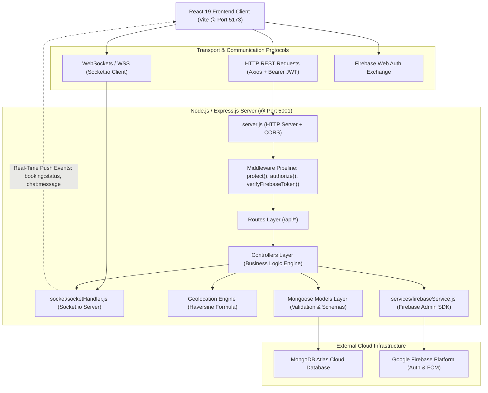
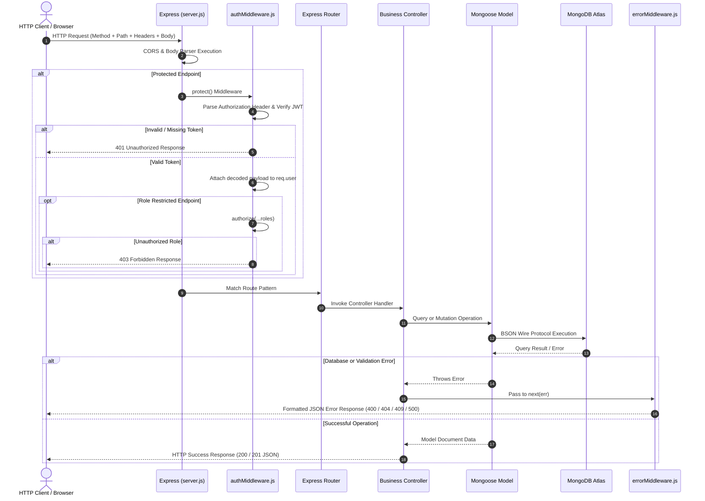
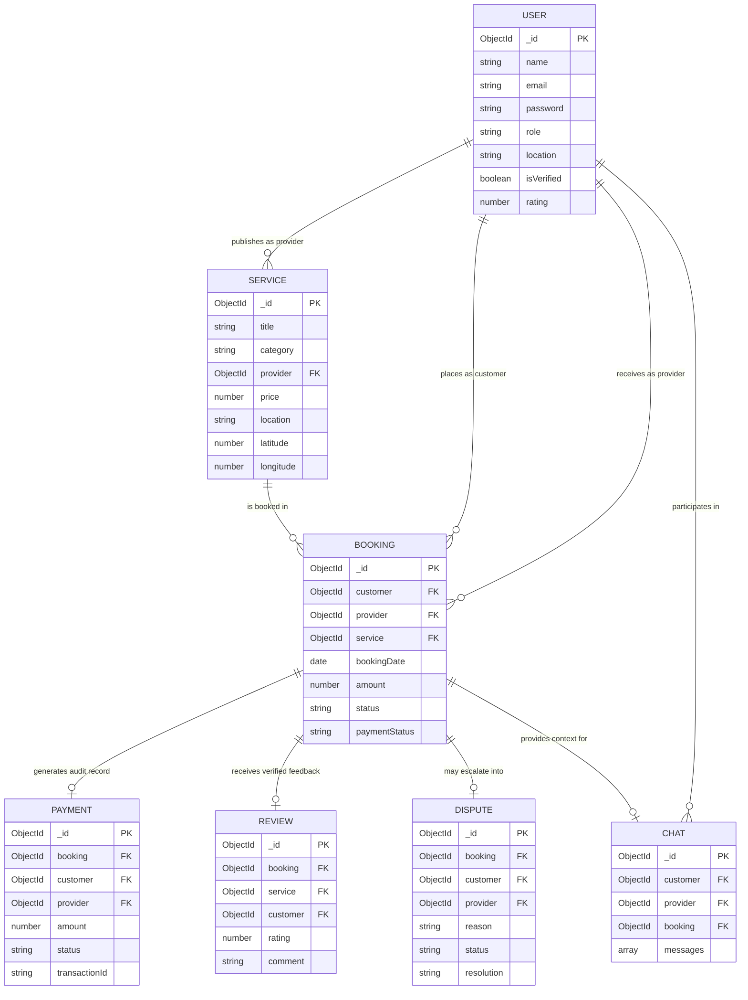
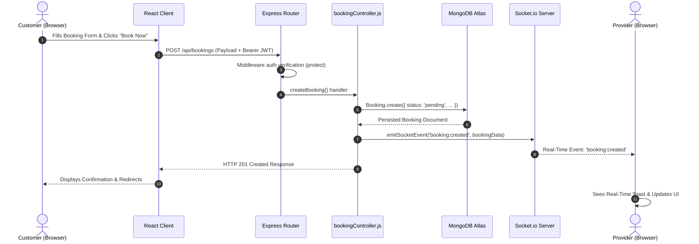

# LocalServe – Local Service Marketplace
## Backend Development and Full-Stack Integration Documentation

---

### Academic Project Report
**Degree:** Bachelor of Technology (B.Tech) in Computer Science & Engineering  
**Student Name:** Sumit Shingole  
**Roll Number:** 150096725081  
**Project Category:** Backend Development / Full-Stack Local Service Marketplace  
**Academic Year:** 2025–2026  

---

## Table of Contents
1. [Abstract](#1-abstract)
2. [Introduction](#2-introduction)
3. [Problem Statement](#3-problem-statement)
4. [Project Objectives](#4-project-objectives)
5. [Technology Stack](#5-technology-stack)
6. [System Architecture](#6-system-architecture)
7. [Project Folder Structure](#7-project-folder-structure)
8. [Server Implementation & Request Lifecycle](#8-server-implementation--request-lifecycle)
9. [Database Design & MongoDB Atlas Configuration](#9-database-design--mongodb-atlas-configuration)
10. [Data Models Specification](#10-data-models-specification)
    - 10.1 [User Model](#101-user-model)
    - 10.2 [Service Model](#102-service-model)
    - 10.3 [Booking Model](#103-booking-model)
    - 10.4 [Payment Model](#104-payment-model)
    - 10.5 [Review Model](#105-review-model)
    - 10.6 [Chat Model](#106-chat-model)
    - 10.7 [Dispute Model](#107-dispute-model)
11. [Complete API Routes Reference](#11-complete-api-routes-reference)
12. [Controllers Architecture](#12-controllers-architecture)
13. [Middleware Architecture](#13-middleware-architecture)
14. [Authentication Systems](#14-authentication-systems)
    - 14.1 [JWT Authentication Pipeline](#141-jwt-authentication-pipeline)
    - 14.2 [Firebase Admin Authentication](#142-firebase-admin-authentication)
15. [Firebase Cloud Messaging (FCM) Integration](#15-firebase-cloud-messaging-fcm-integration)
16. [Real-Time WebSockets via Socket.io](#16-real-time-websockets-via-socketio)
17. [Hyperlocal Geolocation Engine & Mathematical Modeling](#17-hyperlocal-geolocation-engine--mathematical-modeling)
18. [Role-Based Access Control (RBAC) Specification](#18-role-based-access-control-rbac-specification)
19. [Complete End-to-End Business Flow](#19-complete-end-to-end-business-flow)
20. [Error Handling Architecture](#20-error-handling-architecture)
21. [HTTP Status Codes Reference](#21-http-status-codes-reference)
22. [Security Architecture & Implementation](#22-security-architecture--implementation)
23. [Testing & Verification Methodology](#23-testing--verification-methodology)
24. [Postman API Automation Suite](#24-postman-api-automation-suite)
25. [Frontend Client Architecture](#25-frontend-client-architecture)
26. [Sanitized API Request & Response Examples](#26-sanitized-api-request--response-examples)
27. [Database Conceptual Relationship Diagram](#27-database-conceptual-relationship-diagram)
28. [Sequence Diagram: Booking & Live Event Propagation](#28-sequence-diagram-booking--live-event-propagation)
29. [Advantages of LocalServe Architecture](#29-advantages-of-localserve-architecture)
30. [System Limitations](#30-system-limitations)
31. [Future Scope & Roadmap](#31-future-scope--roadmap)
32. [Conclusion](#32-conclusion)
33. [Viva Voce Comprehensive Quick Reference (35 Questions & Answers)](#33-viva-voce-comprehensive-quick-reference-35-questions--answers)
34. [Visual Interface & Verification Placeholders](#34-visual-interface--verification-placeholders)
35. [References & Academic Bibliography](#35-references--academic-bibliography)

---

## 1. Abstract

LocalServe is an enterprise-grade, scalable hyperlocal service marketplace engineered to bridge the gap between skilled local service professionals (e.g., electricians, plumbers, HVAC technicians, cleaners) and community residents seeking immediate, dependable home services. In contemporary urban ecosystems, discovering accredited service providers remains fragmented, plagued by opaque pricing, lack of verified skill credentials, absence of real-time progress visibility, and unreliable scheduling.

This project delivers a full-stack, distributed web platform powered by a **Node.js** and **Express.js** RESTful API engine, backed by a cloud-hosted **MongoDB Atlas** database using **Mongoose ODM**. The platform features dual authentication capabilities—a custom cryptographic **JSON Web Token (JWT)** system alongside **Google Firebase Admin SDK** token verification. Real-time bi-directional status synchronization is orchestrated via **Socket.io** WebSocket rooms, allowing instantaneous booking state transitions and real-time chat between customers and providers without HTTP polling. A specialized mathematical engine implements the **Haversine spherical trigonometry formula** for precision geospatial discovery within custom kilometer radii. The platform is paired with a modern, glassmorphic **React 19 / Vite** single-page client implementing distinct Customer, Provider, and Administrator portals. The entire application has undergone comprehensive integration testing, validating end-to-end resilience from registration to payment simulation and dispute arbitration.

---

## 2. Introduction

Hyperlocal service delivery represents one of the fastest-growing domains of modern consumer technology. Traditional local trade discovery relies heavily on word-of-mouth recommendations, unverified paper directories, and local notice boards. These conventional channels present systemic bottlenecks:
1. **Lack of Trust and Quality Assurance:** Consumers have no visibility into a technician's background, past ratings, or certification status.
2. **Asymmetric Pricing:** Rates are frequently negotiated arbitrarily on-site without baseline standards.
3. **Communication Friction:** Customers cannot track whether a booked technician is en route, scheduled, or delayed.
4. **Dispute Vulnerability:** Cash transactions leave zero audit trails for warranty claims or unresolved damages.

LocalServe addresses these systemic inefficiencies by digitizing the complete lifecycle of hyperlocal service procurement. It provides an automated, secure, and auditable pipeline covering service discovery, provider verification, booking scheduling, real-time status progression, demo payment settlement, rating aggregation, real-time messaging, and administrator dispute management.

---

## 3. Problem Statement

Modern homeowners and commercial tenants face persistent challenges when attempting to identify, vet, book, and settle accounts with local tradespeople. Concurrently, independent technicians and skilled trades workers lack modern digital tools to market their offerings, broadcast their operational coverage, receive structured bookings, and maintain auditable transaction records.

The LocalServe platform formalizes and solves these challenges across three primary stakeholder personas:

### Customer Requirements:
- Discover verified service offerings filtered by trade category, price ceiling, minimum rating, and proximity.
- Schedule bookings with specific date, time window, address, and special instructions.
- Track service progression in real time without manual page refreshes.
- Engage in two-way real-time chat with the assigned service professional.
- Settle service charges electronically and submit verified ratings and written feedback upon job completion.
- File formal disputes in the event of substandard execution or operational disagreements.

### Provider Requirements:
- Publish and manage service listings with transparent base rates, descriptions, and schedule availability.
- Broadcast geographic coordinates for proximity-based customer matching.
- Receive live notifications of incoming booking requests.
- Transition booking lifecycles through standardized milestones (`pending` → `confirmed` → `in_progress` → `completed` or `rejected`).
- Maintain an auditable log of fulfilled services and accumulated earnings.

### Administrator Requirements:
- Audit provider accounts and toggle cryptographic verification badges.
- Arbitrate escalated customer-provider disputes with documented resolution notes.
- Maintain marketplace catalog integrity by moderating or removing substandard service listings.

---

## 4. Project Objectives

The technical objectives achieved by this project include:
1. **RESTful API Engineering:** Architect and deploy 26 modular REST endpoints following strict HTTP conventions and JSON serialization.
2. **Cloud Document Storage:** Design and index 7 MongoDB document schemas hosted on MongoDB Atlas via Mongoose ODM.
3. **Dual Authentication Framework:** Implement bcrypt password hashing (10 salt rounds) and stateless JWT issuance alongside Google Firebase Admin SDK token verification (`verifyIdToken`).
4. **Role-Based Authorization:** Secure endpoints through declarative middleware supporting `customer`, `provider`, and `admin` access tiers.
5. **Real-Time WebSocket Architecture:** Implement Socket.io server logic supporting custom rooms (`user_<id>`, `booking_<id>`, `chat_<id>`) and instantaneous event distribution.
6. **Geospatial Proximity Calculation:** Construct a mathematical Haversine engine calculating great-circle distances between GPS coordinates on Earth's spherical surface.
7. **Complete Business Process Automation:** Implement booking workflows, transactional demo payment records, duplicate-protected review submissions, and dispute resolution.
8. **Modern Client Application:** Construct a responsive, Glassmorphic React 19 application utilizing React Router v7, Axios interceptors, Lucide icons, and pure CSS3 design tokens.
9. **Rigorous Quality Assurance:** Validate all API endpoints, Socket.io broadcasts, and database transactions via Postman automation and Node.js integration test suites.

---

## 5. Technology Stack

| Layer / Component | Technology | Version / Specification | Architectural Purpose |
| :--- | :--- | :--- | :--- |
| **Runtime Environment** | Node.js | v22.x LTS (V8 Engine) | Non-blocking, event-driven server execution |
| **Backend Framework** | Express.js | ^5.2.1 | HTTP routing, middleware pipeline, and REST controller orchestration |
| **Database Management** | MongoDB Atlas | Cloud M0 Cluster / MongoDB 7.x | Cloud NoSQL document storage with JSON-like BSON serialization |
| **Object Data Modeling** | Mongoose | ^9.10.3 | Schema definition, type validation, middleware hooks, and relationship population |
| **Primary Authentication** | JSON Web Tokens (jsonwebtoken) | ^9.0.3 | Stateless cryptographic token signing and verification (`HS256`) |
| **Password Hashing** | bcrypt | ^6.0.0 | One-way salted hashing (10 salt rounds) for password confidentiality |
| **Cloud Authentication** | Firebase Admin SDK | ^14.5.0 | Server-side verification of Google Firebase ID tokens via OAuth2 certs |
| **Cloud Push Messaging** | Firebase Cloud Messaging (FCM) | Modular SDK (`firebase-admin/messaging`) | Cross-platform push notifications with automated development mock fallback |
| **Real-Time Communication** | Socket.io | ^4.8.4 | WebSocket and HTTP long-polling transport for real-time room-based updates |
| **Cross-Origin Security** | cors | ^2.8.6 | Configurable HTTP headers for frontend domain origin permissions |
| **Environment Config** | dotenv | ^18.0.5 | Secure loading of environment variables from `.env` |
| **Frontend Framework** | React | ^19.0.0 | Component-based dynamic user interface construction |
| **Build Tool & Bundler** | Vite | ^8.3.3 | Next-generation Hot Module Replacement (HMR) and optimized build bundling |
| **Client Routing** | React Router DOM | ^7.x | Declarative client-side routing with protected role gates |
| **HTTP Client** | Axios | ^1.x | Promise-based HTTP client with automated Bearer token request interceptors |
| **Client WebSockets** | socket.io-client | ^4.8.4 | Browser-side WebSocket listener for live notifications and status sync |
| **Styling & Aesthetics** | Pure CSS3 (Liquid Glass) | CSS3 Custom Properties & Backdrop Filter | High-end glassmorphism design system (`#2563eb`, `#10b981`) without third-party CSS bloat |
| **Iconography** | Lucide React | ^1.x | Clean, scalable SVG icons |
| **API Testing Suite** | Postman | v2.1.0 Collection Spec | Automated endpoint testing, dynamic pre-request scripts, and environment tests |

---

## 6. System Architecture

LocalServe adopts a decoupled **N-Tier Client-Server Architecture** separating presentation, business logic, data modeling, cloud services, and persistence layers.

### Architectural Diagram



### Architectural Layer Descriptions:
1. **Client Tier (Frontend):** React Single-Page Application maintaining authentication tokens in `localStorage`, managing global auth state via `AuthContext`, and subscribing to active Socket.io channels through `SocketContext`.
2. **Network Transport Tier:** Dual communication protocols utilizing asynchronous RESTful JSON exchange over HTTP/1.1 or HTTP/2, complemented by full-duplex persistent WebSocket connections.
3. **Middleware & Security Tier:** Intercepts incoming requests to validate authentication headers, verify cryptographic signatures, decode claims, enforce role authorization guards, and format errors.
4. **Business Logic & Controller Tier:** Encapsulates core business rules—ensuring state validity, aggregating ratings, verifying booking ownership, and invoking notification handlers.
5. **Persistence Tier (Mongoose ODM & MongoDB Atlas):** Schema-enforced document persistence with strict type checking, compound indexing for efficient query execution, and relational referencing via `ObjectId`.
6. **Cloud Services Tier:** Google Firebase infrastructure utilized for decentralized ID token cryptographic verification and cloud messaging.

---

## 7. Project Folder Structure

The repository maintains strict separation of concerns between backend server assets and client frontend modules:

```
LocalServe(Backend_Project)/
├── config/
│   └── db.js                        # MongoDB Mongoose cloud connection configuration
├── controllers/
│   ├── adminController.js           # Provider accreditation & dispute arbitration logic
│   ├── authController.js            # User registration, JWT login, Firebase profile retrieval
│   ├── bookingController.js         # Booking CRUD, status lifecycle, socket event triggering
│   ├── chatController.js            # 1-to-1 conversation creation & message appending
│   ├── geolocationController.js     # Haversine distance calculations & location searches
│   ├── notificationController.js    # Push notification dispatching via FCM
│   ├── paymentController.js         # Transaction recording & booking payment confirmation
│   ├── providerController.js        # Provider catalog queries & profile modifications
│   ├── reviewController.js          # Rating submissions & average score recalculation
│   └── serviceController.js         # Service listing lifecycle (CRUD) & filtering
├── frontend/                        # Complete React 19 + Vite Single-Page Application
│   ├── public/                      # Static web assets & vector icons
│   ├── src/
│   │   ├── components/              # 19 Reusable UI components (GlassCard, Timeline, etc.)
│   │   ├── context/                 # AuthContext (JWT/Firebase) & SocketContext (WebSocket)
│   │   ├── firebase/                # Client Firebase Web SDK initialization config
│   │   ├── layouts/                 # MainLayout (Public) & DashboardLayout (Sidebar)
│   │   ├── pages/
│   │   │   ├── admin/               # AdminDashboard, AdminProviders, AdminDisputes, etc.
│   │   │   ├── auth/                # Login, Register
│   │   │   ├── customer/            # CustomerDashboard, CustomerBookings, BookingDetails, etc.
│   │   │   ├── provider/            # ProviderDashboard, ProviderServices, ServiceForm, etc.
│   │   │   └── public/              # Home, Services, ServiceDetails, Providers, etc.
│   │   ├── services/                # 11 Modular Axios API service files
│   │   ├── App.jsx                  # React Router v7 routes definition & role wrappers
│   │   ├── index.css                # Liquid Glass glassmorphism design tokens & styles
│   │   └── main.jsx                 # React root mounting entrypoint
│   ├── index.html                   # HTML5 shell with viewport & SEO metadata
│   ├── package.json                 # Frontend dependencies (React, Vite, Lucide, Axios)
│   └── vite.config.js               # Vite compilation & dev server configuration
├── middleware/
│   ├── authMiddleware.js            # JWT protection (protect) & Role checking (authorize)
│   ├── errorMiddleware.js           # 404 handler (notFound) & centralized error formatter
│   └── firebaseAuthMiddleware.js    # Firebase ID token verifier (verifyFirebaseToken)
├── models/
│   ├── Booking.js                   # Booking schema, status enums, and compound indexes
│   ├── Chat.js                      # Conversation schema with embedded message arrays
│   ├── Dispute.js                   # Conflict arbitration schema with resolution notes
│   ├── Payment.js                   # Transaction audit schema with unique transactionId
│   ├── Review.js                    # Review schema with unique booking constraint
│   ├── Service.js                   # Marketplace service schema with geospatial coordinates
│   └── User.js                      # User schema with bcrypt passwords & role enums
├── postman/
│   ├── LocalServe.postman_collection.json    # 26 automated Postman integration requests
│   └── LocalServe.postman_environment.json   # Dynamic test variables (tokens, IDs)
├── routes/
│   ├── adminRoutes.js               # /api/admin endpoints
│   ├── authRoutes.js                # /api/auth endpoints
│   ├── bookingRoutes.js             # /api/bookings endpoints
│   ├── chatRoutes.js                # /api/chats endpoints
│   ├── geolocationRoutes.js         # /api/geolocation endpoints
│   ├── notificationRoutes.js        # /api/notifications endpoints
│   ├── paymentRoutes.js             # /api/payments endpoints
│   ├── providerRoutes.js            # /api/providers endpoints
│   ├── reviewRoutes.js              # /api/reviews endpoints
│   ├── serviceRoutes.js             # /api/services endpoints
│   └── userRoutes.js                # /api/users endpoints
├── services/
│   └── firebaseService.js           # Firebase Admin SDK init, cert parsing, FCM dispatcher
├── socket/
│   └── socketHandler.js             # Socket.io room orchestration & event broadcast helpers
├── utils/
│   └── generateToken.js             # Cryptographic JWT signing utility with expiration
├── .env.example                     # Sanitized environment variable template
├── .gitignore                       # Git exclusion list (protecting node_modules, .env)
├── package.json                     # Backend manifest, dependencies, and npm scripts
└── server.js                        # Master HTTP server, Socket.io attachment, route wiring
```

---

## 8. Server Implementation & Request Lifecycle

The backend application is initialized and driven by [`server.js`](file:///Users/sumitshingole/LocalServe(Backend_Project)/server.js).

### Server Initialization Sequence:
1. **Environment Initialization:** Calls `dotenv.config()` synchronously as the first operational statement to ensure all environment credentials (`PORT`, `MONGO_URI`, `JWT_SECRET`, `FIREBASE_*`) are populated into `process.env`.
2. **Database Binding:** Executes `connectDB()`, initiating an asynchronous connection handshake with MongoDB Atlas via Mongoose.
3. **Middleware Registration:** Attaches CORS (`cors()`) to permit cross-origin requests, `express.json()` for parsing incoming JSON bodies, and `express.urlencoded()` for URL-encoded payloads.
4. **Root Health Check:** Mounts a root route `GET /` returning `"LocalServe API is running"`.
5. **Route Registration:** Mounts 11 dedicated route routers under `/api/*`.
6. **Error Interception:** Binds the `notFound` handler to catch unresolved paths, followed by the `errorHandler` middleware.
7. **HTTP & WebSocket Coupling:** Encapsulates the Express `app` inside a standard Node.js `http.createServer(app)`. Socket.io is initialized through `initSocket(server)`.
8. **Port Binding:** The server listens on `process.env.PORT || 5001`.

### Request Lifecycle Diagram



---

## 9. Database Design & MongoDB Atlas Configuration

LocalServe leverages **MongoDB Atlas**, a managed cloud document database engine. Unlike relational databases, MongoDB stores records as flexible, BSON (Binary JSON) documents.

### Key Architectural Concepts:
- **Database (`localserve`):** The logical container hosting all collections.
- **Collections:** Equivalents of database tables, grouping related JSON documents (`users`, `services`, `bookings`, `payments`, `reviews`, `chats`, `disputes`).
- **Documents:** Individual records stored with dynamic field structures.
- **Primary Keys (`_id`):** Every document is automatically assigned an immutable `_id` of type `ObjectId` (a 12-byte BSON identifier containing timestamp, machine identifier, process ID, and incrementing counter).
- **Mongoose ODM:** Provides programmatic schemas, strict data typing, default values, validators, compound index generation, and `.populate()` functionality for simulated document joins.

---

## 10. Data Models Specification

### 10.1 User Model
**File:** [`models/User.js`](file:///Users/sumitshingole/LocalServe(Backend_Project)/models/User.js)  
**Collection Name:** `users`  
**Purpose:** Manages core accounts for customers, service providers, and platform administrators.

| Field | BSON Type | Validation Rules | Default | Description |
| :--- | :--- | :--- | :--- | :--- |
| `name` | String | Required, Trimmed | N/A | Full name of the user |
| `email` | String | Required, Unique, Lowercase, Trimmed | N/A | Primary login email address |
| `password` | String | Required, Min length 6 | N/A | bcrypt salted password hash |
| `phone` | String | Trimmed | `""` | Contact phone number |
| `role` | String | Enum: `['customer', 'provider', 'admin']` | `'customer'` | Authorization access level |
| `location` | String | Trimmed | `""` | Geographic operating city/locality |
| `bio` | String | Trimmed | `""` | Provider professional bio/summary |
| `serviceCategories`| Array of Strings | N/A | `[]` | List of trades/skills offered |
| `isVerified` | Boolean | N/A | `false` | Administrator audit verification flag |
| `rating` | Number | Numeric | `0` | Running average customer rating |
| `numReviews` | Number | Numeric | `0` | Total completed job reviews received |
| `createdAt` | Date | Auto Mongoose Timestamp | Auto | Creation timestamp |
| `updatedAt` | Date | Auto Mongoose Timestamp | Auto | Modification timestamp |

---

### 10.2 Service Model
**File:** [`models/Service.js`](file:///Users/sumitshingole/LocalServe(Backend_Project)/models/Service.js)  
**Collection Name:** `services`  
**Purpose:** Catalogs discrete service offerings published by verified providers.

| Field | BSON Type | Validation Rules | Default | Description |
| :--- | :--- | :--- | :--- | :--- |
| `title` | String | Required, Trimmed | N/A | Descriptive service title |
| `description` | String | Required, Trimmed | N/A | Detailed description of scope |
| `category` | String | Required, Trimmed | N/A | Trade category (e.g. Electrical, Plumbing) |
| `provider` | ObjectId | Ref: `'User'`, Required | N/A | Foreign reference to provider account |
| `price` | Number | Required, Min: 0 | N/A | Base service fee in INR |
| `availability`| String | Trimmed | `'Available'` | Schedule window (e.g. Mon-Sat 9am-6pm) |
| `location` | String | Required, Trimmed | N/A | Primary city or neighborhood |
| `latitude` | Number | Double / Float | `null` | WGS84 GPS Latitude coordinate |
| `longitude` | Number | Double / Float | `null` | WGS84 GPS Longitude coordinate |
| `rating` | Number | Numeric | `0` | Average rating for this listing |
| `numReviews` | Number | Numeric | `0` | Cumulative review count |

**Indexes:**
- Compound index on `{ category: 1, location: 1 }` for filter acceleration.
- Text search index on `{ title: "text", description: "text" }` for full-text search.

---

### 10.3 Booking Model
**File:** [`models/Booking.js`](file:///Users/sumitshingole/LocalServe(Backend_Project)/models/Booking.js)  
**Collection Name:** `bookings`  
**Purpose:** Tracks service engagements between customers and providers.

| Field | BSON Type | Validation Rules | Default | Description |
| :--- | :--- | :--- | :--- | :--- |
| `customer` | ObjectId | Ref: `'User'`, Required | N/A | Foreign key of booking customer |
| `provider` | ObjectId | Ref: `'User'`, Required | N/A | Foreign key of assigned provider |
| `service` | ObjectId | Ref: `'Service'`, Required | N/A | Foreign key of booked service |
| `bookingDate`| Date | Required | N/A | Scheduled service appointment date & time |
| `amount` | Number | Required, Min: 0 | N/A | Agreed total charge for service |
| `status` | String | Enum: `['pending', 'confirmed', 'in_progress', 'completed', 'cancelled', 'rejected']` | `'pending'` | Current execution milestone |
| `address` | String | Required, Trimmed | N/A | Customer service location address |
| `notes` | String | Trimmed | `""` | Special instructions from customer |
| `paymentStatus`| String| Enum: `['pending', 'paid', 'failed', 'refunded']` | `'pending'` | Payment settlement status |

**Indexes:** Compound indexes on `{ customer: 1, createdAt: -1 }`, `{ provider: 1, createdAt: -1 }`, and `{ service: 1 }`.

---

### 10.4 Payment Model
**File:** [`models/Payment.js`](file:///Users/sumitshingole/LocalServe(Backend_Project)/models/Payment.js)  
**Collection Name:** `payments`  
**Purpose:** Auditable transactional records for demo settlement.  
*Note: This models demonstration and audit records; external live payment gateway processing (e.g. Stripe, Razorpay) is slated for Future Scope.*

| Field | BSON Type | Validation Rules | Default | Description |
| :--- | :--- | :--- | :--- | :--- |
| `booking` | ObjectId | Ref: `'Booking'`, Required | N/A | Target booking reference |
| `customer` | ObjectId | Ref: `'User'`, Required | N/A | Payer user reference |
| `provider` | ObjectId | Ref: `'User'`, Required | N/A | Payee user reference |
| `amount` | Number | Required, Min: 0 | N/A | Settled transaction amount |
| `status` | String | Enum: `['pending', 'paid', 'failed', 'refunded']` | `'paid'` | Payment outcome status |
| `paymentMethod`| String| Trimmed | `'card'` | Channel: `'upi'`, `'card'`, or `'cash'` |
| `transactionId`| String| Required, Trimmed | N/A | Unique simulated receipt code |

---

### 10.5 Review Model
**File:** [`models/Review.js`](file:///Users/sumitshingole/LocalServe(Backend_Project)/models/Review.js)  
**Collection Name:** `reviews`  
**Purpose:** Captures verified customer feedback upon job completion.

| Field | BSON Type | Validation Rules | Default | Description |
| :--- | :--- | :--- | :--- | :--- |
| `customer` | ObjectId | Ref: `'User'`, Required | N/A | Review author reference |
| `service` | ObjectId | Ref: `'Service'`, Required | N/A | Service reviewed reference |
| `booking` | ObjectId | Ref: `'Booking'`, Required, **Unique** | N/A | One review allowed per booking |
| `rating` | Number | Required, Min: 1, Max: 5 | N/A | Numerical score from 1 to 5 |
| `comment` | String | Required, Trimmed | N/A | Written customer critique |

---

### 10.6 Chat Model
**File:** [`models/Chat.js`](file:///Users/sumitshingole/LocalServe(Backend_Project)/models/Chat.js)  
**Collection Name:** `chats`  
**Purpose:** Maintains persistent conversation threads between customers and providers.

| Field | BSON Type | Validation Rules | Default | Description |
| :--- | :--- | :--- | :--- | :--- |
| `customer` | ObjectId | Ref: `'User'`, Required | N/A | Participating customer |
| `provider` | ObjectId | Ref: `'User'`, Required | N/A | Participating provider |
| `booking` | ObjectId | Ref: `'Booking'` | `null` | Contextual booking association |
| `messages` | Array of Objects | Subdocument Schema | `[]` | Embedded list of message records |
| `messages.sender` | ObjectId | Ref: `'User'`, Required | N/A | User ID of message author |
| `messages.message`| String | Required, Trimmed | N/A | Text content of communication |
| `messages.timestamp`| Date | Date | `Date.now` | UTC transmission timestamp |

---

### 10.7 Dispute Model
**File:** [`models/Dispute.js`](file:///Users/sumitshingole/LocalServe(Backend_Project)/models/Dispute.js)  
**Collection Name:** `disputes`  
**Purpose:** Formal escalation mechanism for dissatisfied customers or providers.

| Field | BSON Type | Validation Rules | Default | Description |
| :--- | :--- | :--- | :--- | :--- |
| `customer` | ObjectId | Ref: `'User'`, Required | N/A | Customer involved in incident |
| `provider` | ObjectId | Ref: `'User'`, Required | N/A | Provider involved in incident |
| `booking` | ObjectId | Ref: `'Booking'`, Required | N/A | Disputed booking engagement |
| `reason` | String | Required, Trimmed | N/A | High-level grievance category |
| `description`| String | Required, Trimmed | N/A | Comprehensive explanation of grievance |
| `status` | String | Enum: `['open', 'under_review', 'resolved', 'rejected']` | `'open'` | Operational case lifecycle |
| `resolution` | String | Trimmed | `""` | Official administrator judgment note |

---

## 11. Complete API Routes Reference

Below is the exhaustive catalog of all 26 REST endpoints implemented in the codebase:

| HTTP Method | Route Endpoint | Controller Handler | Auth Required | Role Constraint | Purpose & Payload Notes |
| :--- | :--- | :--- | :--- | :--- | :--- |
| `POST` | `/api/auth/register` | `registerUser` | No | Public | Register user account (`name`, `email`, `password`, `role`) |
| `POST` | `/api/auth/login` | `loginUser` | No | Public | Authenticate credentials; returns signed JWT & user profile |
| `GET` | `/api/auth/firebase-profile`| `getFirebaseProfile` | Yes (Firebase) | Any Firebase User | Validates Firebase ID Token; returns safe decoded profile |
| `GET` | `/api/users/profile` | Inline Handler | Yes (JWT) | Any Authenticated | Verifies JWT Bearer token integrity; returns `req.user` |
| `GET` | `/api/services` | `getServices` | No | Public | Query service catalog with optional search & filters |
| `GET` | `/api/services/:id` | `getServiceById` | No | Public | Retrieve detailed service document with populated provider |
| `POST` | `/api/services` | `createService` | Yes (JWT) | `provider` | Publish new listing (`title`, `price`, `location`, coordinates) |
| `PUT` | `/api/services/:id` | `updateService` | Yes (JWT) | `provider`, `admin` | Update service attributes (owner provider or admin) |
| `DELETE`| `/api/services/:id` | `deleteService` | Yes (JWT) | `provider`, `admin` | Remove service listing permanently |
| `GET` | `/api/providers` | `getProviders` | No | Public | Filterable list of provider profiles with verification state |
| `GET` | `/api/providers/:id` | `getProviderById` | No | Public | Provider profile data alongside their published services |
| `PUT` | `/api/providers/:id` | `updateProvider` | Yes (JWT) | `provider`, `admin` | Update provider bio, categories, location, and experience |
| `POST` | `/api/bookings` | `createBooking` | Yes (JWT) | `customer` | Schedule booking; emits `booking:created` via Socket.io |
| `GET` | `/api/bookings` | `getBookings` | Yes (JWT) | Any Authenticated | Retrieve bookings filtered by caller role (Customer/Provider/Admin) |
| `GET` | `/api/bookings/:id` | `getBookingById` | Yes (JWT) | Booking Participant / Admin | Retrieve full booking document with populated customer & provider |
| `PUT` | `/api/bookings/:id/status`| `updateBookingStatus` | Yes (JWT) | Participant / Admin | Transition status; emits `booking:status` via Socket.io |
| `POST` | `/api/payments` | `createPayment` | Yes (JWT) | `customer`, `admin` | Record demo payment settlement; updates booking `paymentStatus` |
| `GET` | `/api/payments/booking/:id`| `getPaymentsByBooking`| Yes (JWT) | Participant / Admin | Fetch transaction receipt records by booking ID |
| `POST` | `/api/reviews` | `createReview` | Yes (JWT) | `customer` | Submit rating (1-5) & comment for completed booking |
| `GET` | `/api/reviews/service/:id`| `getServiceReviews` | No | Public | Fetch published customer reviews for target service |
| `GET` | `/api/chats` | `getUserChats` | Yes (JWT) | Any Authenticated | Fetch active conversations for authenticated caller |
| `POST` | `/api/chats` | `createOrSendMessage` | Yes (JWT) | Any Authenticated | Start chat or post message; broadcasts to WebSocket room |
| `GET` | `/api/chats/:id` | `getChatById` | Yes (JWT) | Chat Participant / Admin | Retrieve conversation thread history with messages |
| `GET` | `/api/geolocation/nearby` | `getNearbyServices` | No | Public | Filter services by latitude, longitude, and radius using Haversine |
| `GET` | `/api/geolocation/search` | `searchServices` | No | Public | Text-based search by city, keyword, or service category |
| `GET` | `/api/admin/providers` | `getAdminProviders` | Yes (JWT) | `admin` | List all providers enhanced with service & booking totals |
| `PUT` | `/api/admin/verify/:id` | `verifyProvider` | Yes (JWT) | `admin` | Set provider accreditation `isVerified: true/false` |
| `GET` | `/api/admin/disputes` | `getDisputes` | Yes (JWT) | `admin` | Retrieve all customer-provider grievances |
| `PUT` | `/api/admin/disputes/:id` | `resolveDispute` | Yes (JWT) | `admin` | Resolve or reject dispute with resolution text |
| `POST` | `/api/admin/disputes` | `createDispute` | Yes (JWT) | Any Authenticated | File official dispute against an associated booking |
| `POST` | `/api/notifications/send` | `sendNotification` | Yes (JWT) | Any Authenticated | Dispatch push notification via FCM (or mock simulator) |

---

## 12. Controllers Architecture

Every controller cleanly separates business logic from routing declarations:

1. **`authController.js`:** Validates uniqueness of user emails, enforces minimum 6-character passwords, salts hashes with bcrypt (10 rounds), registers users, and signs JWT tokens with role claims. Coordinates Firebase ID token profile unpacking.
2. **`serviceController.js`:** Handles CRUD for service offerings. Manages input validation, enforces ownership checks so only the creating provider or platform administrators can edit or delete listings.
3. **`bookingController.js`:** Coordinates booking creation, binds the customer and service provider, triggers the `booking:created` Socket.io broadcast, executes the FCM notification trigger, and manages the lifecycle progression (`pending` → `confirmed` → `in_progress` → `completed`).
4. **`providerController.js`:** Queries verified and unverified service providers, handles category filtering, and supports profile updates.
5. **`paymentController.js`:** Enforces authorization so customers can only pay for their own bookings. Records the transaction amount, method, and transaction code, immediately transitioning the associated booking's `paymentStatus` to `'paid'`.
6. **`reviewController.js`:** Validates that the associated booking has reached `'completed'` status, enforces single-review uniqueness constraints per booking, and recalculates the service's and provider's cumulative rating.
7. **`chatController.js`:** Manages 1-to-1 conversation creation, pushes timestamped messages into subdocument arrays, and broadcasts events across `chat_<id>` rooms.
8. **`geolocationController.js`:** Implements trigonometric spherical computation (Haversine formula) to filter services within user-specified radius distances.
9. **`adminController.js`:** Provides administrative auditing features, joins service/booking counts with provider documents, toggles verified flags, and arbitrates disputes.
10. **`notificationController.js`:** Formats FCM payloads and interfaces with `services/firebaseService.js`.

---

## 13. Middleware Architecture

The middleware pipeline provides reusable security, validation, and error interception:

### 13.1 `protect` (JWT Authentication Guard)
Extracts the HTTP `Authorization` header, verifies the `Bearer <token>` format, decodes the signature using `process.env.JWT_SECRET`, and binds the decoded user metadata (`id`, `_id`, `role`) directly to `req.user`. Returns `401 Unauthorized` for missing or malformed tokens.

### 13.2 `authorize(...roles)` (RBAC Guard)
Executes after `protect`. Compares `req.user.role` against an allowed whitelist. If the caller's role is not included, it short-circuits the request and returns `403 Forbidden`.

### 13.3 `verifyFirebaseToken`
Validates Google Firebase client tokens. Reads the `Bearer <token>` header and verifies its authenticity against Google's public key certificates using `admin.auth().verifyIdToken(token)`. Decodes claims into `req.firebaseUser`. Returns `401 Unauthorized` for invalid tokens and `503 Service Unavailable` if Firebase credentials are not configured.

### 13.4 `notFound` & `errorHandler`
Catches unhandled paths with `404 Not Found`. The centralized `errorHandler` translates internal errors into clean JSON responses:
- Mongoose `CastError` (invalid ObjectId syntax) → `400 Bad Request` ("Invalid resource ID format").
- Mongoose `ValidationError` → `400 Bad Request` with human-readable validation messages.
- MongoDB code `11000` (duplicate key constraint) → `409 Conflict`.
- `JsonWebTokenError` / `TokenExpiredError` → `401 Unauthorized`.

---

## 14. Authentication Systems

LocalServe implements **two concurrent authentication engines**:

### 14.1 JWT Authentication Pipeline
The primary authentication system for LocalServe users:
1. **Registration:** `POST /api/auth/register` accepts account details.
2. **Password Cryptography:** bcrypt generates an unpredictable salt (10 rounds) and computes an irreversible one-way hash stored in MongoDB. Plaintext passwords are never stored.
3. **Token Issuance:** `POST /api/auth/login` verifies the password via `bcrypt.compare()`. Upon success, `generateToken(userId, role)` signs a compact, URL-safe JWT with a 7-day expiration (`JWT_EXPIRES_IN`).
4. **Stateless Verification:** Subsequent API requests attach `Authorization: Bearer <token>`. The server decodes and validates the signature on every request without requiring database session lookups.

### 14.2 Firebase Admin Authentication
Provides cloud authentication interoperability:
1. Client logs in using the Firebase Web SDK.
2. The client retrieves a Firebase ID token.
3. The client calls `GET /api/auth/firebase-profile` passing `Authorization: Bearer <Firebase ID Token>`.
4. `middleware/firebaseAuthMiddleware.js` verifies the token server-side using `admin.auth().verifyIdToken()`.
5. The backend returns safe identity claims (`uid`, `email`, `email_verified`, `auth_time`).

---

## 15. Firebase Cloud Messaging (FCM) Integration

LocalServe integrates Google Firebase Cloud Messaging via [`services/firebaseService.js`](file:///Users/sumitshingole/LocalServe(Backend_Project)/services/firebaseService.js).

### Push Notification Workflow:
1. When a booking is created (`POST /api/bookings`), `sendBookingNotification` is invoked.
2. If Firebase service account credentials (`FIREBASE_PROJECT_ID`, `FIREBASE_CLIENT_EMAIL`, `FIREBASE_PRIVATE_KEY`) are present, `firebase-admin/messaging` dispatches an official FCM push packet to the target provider device token.
3. **Graceful Development Fallback:** If credentials are not supplied, the service automatically switches to **Mock Simulator Mode**, logging the simulated payload to the terminal without crashing the application.

---

## 16. Real-Time WebSockets via Socket.io

While REST APIs are ideal for state modifications, they require inefficient client polling for live status tracking. LocalServe uses **Socket.io** over WebSockets to provide instantaneous bi-directional communication.

### Socket.io Lifecycle & Events:
- **Connection Handshake:** Client connects to `http://localhost:5001`.
- **`join_user`:** Client sends their user ID. The server binds the socket to room `user_<userId>`.
- **`join_booking`:** Client enters a booking room `booking_<bookingId>`.
- **`booking:created`:** Emitted when a new booking is submitted. Broadcasts to the assigned provider's room (`user_<providerId>`) and globally.
- **`booking:status`:** Emitted when a booking changes status (`pending` → `confirmed` → `in_progress` → `completed`). All sockets in room `booking_<bookingId>` receive the update instantly.
- **`chat:message`:** Emitted to room `chat_<chatId>` when messages are posted, updating the chat UI immediately without page refreshes.

---

## 17. Hyperlocal Geolocation Engine & Mathematical Modeling

LocalServe calculates exact physical distances between customers and providers using the **Haversine Formula**, accounting for the Earth's spherical curvature.

### The Haversine Formula

Given two coordinates $(\text{lat}_1, \text{lon}_1)$ and $(\text{lat}_2, \text{lon}_2)$ in radians:

$$\Delta\text{lat} = \text{lat}_2 - \text{lat}_1$$
$$\Delta\text{lon} = \text{lon}_2 - \text{lon}_1$$

$$a = \sin^2\left(\frac{\Delta\text{lat}}{2}\right) + \cos(\text{lat}_1) \cdot \cos(\text{lat}_2) \cdot \sin^2\left(\frac{\Delta\text{lon}}{2}\right)$$

$$c = 2 \cdot \text{atan2}\left(\sqrt{a}, \sqrt{1 - a}\right)$$

$$d = R \cdot c$$

Where:
- $R = 6371\text{ km}$ (mean radius of Earth).
- $d$ is the calculated great-circle distance in kilometers.

In [`controllers/geolocationController.js`](file:///Users/sumitshingole/LocalServe(Backend_Project)/controllers/geolocationController.js#L6-L19), this calculation runs on all coordinate-enabled services, filtering results by the requested radius and sorting them nearest-first.

---

## 18. Role-Based Access Control (RBAC) Specification

| Resource & Operation | Public / Guest | Customer | Provider | Administrator |
| :--- | :---: | :---: | :---: | :---: |
| **Browse / Search Services** | Allowed | Allowed | Allowed | Allowed |
| **View Provider Profiles** | Allowed | Allowed | Allowed | Allowed |
| **Create Service Listing** | Denied | Denied | **Allowed** | Denied |
| **Edit / Delete Service Listing** | Denied | Denied | **Owner Only** | **Allowed** |
| **Create Booking** | Denied | **Allowed** | Denied | Denied |
| **View Bookings** | Denied | Own Bookings | Own Bookings | All Bookings |
| **Advance Booking Status** | Denied | Cancel Only | **Allowed** | **Allowed** |
| **Simulate Payment** | Denied | **Own Bookings** | Denied | **Allowed** |
| **Submit Review** | Denied | **Completed Bookings** | Denied | Denied |
| **Chat with Counterpart** | Denied | **Allowed** | **Allowed** | **Allowed** |
| **Verify / Unverify Providers** | Denied | Denied | Denied | **Allowed** |
| **Arbitrate & Resolve Disputes**| Denied | Denied | Denied | **Allowed** |

---

## 19. Complete End-to-End Business Flow

LocalServe implements a verified 14-step business transaction lifecycle:

```
[1. Provider Registration] ──────> [2. Provider Creates Service]
          │                                      │
          ▼                                      ▼
[3. Customer Registration] ─────> [4. Customer Searches Catalog]
                                                 │
                                                 ▼
[6. Real-Time Socket Broadcast] <── [5. Customer Books Service]
          │
          ▼
[7. Provider Confirms Booking] ──> [8. Customer Settles Payment]
          │                                      │
          ▼                                      ▼
[9. Provider Starts Service] ────> [10. Service Marked Completed]
                                                 │
                                                 ▼
[12. Real-Time Chat Messaging] <─── [11. Customer Submits Review]
          │
          ▼
[13. Admin Audits / Verifies] ───> [14. Dispute Resolution Desk]
```

1. **Provider Registration:** `POST /api/auth/register` creates a provider account.
2. **Service Creation:** `POST /api/services` publishes an offering with price and location.
3. **Customer Registration:** `POST /api/auth/register` creates a customer account.
4. **Service Discovery:** `GET /api/services` or `GET /api/geolocation/nearby` identifies the service.
5. **Booking Creation:** `POST /api/bookings` initiates a request in `'pending'` status.
6. **Live Broadcast:** Socket.io emits `booking:created` to the provider room.
7. **Status Confirmation:** `PUT /api/bookings/:id/status` moves status to `'confirmed'`. Socket.io broadcasts `booking:status`.
8. **Payment Settlement:** `POST /api/payments` records the transaction, setting `paymentStatus: 'paid'`.
9. **Service Execution:** Provider sets status to `'in_progress'`.
10. **Service Completion:** Provider sets status to `'completed'`.
11. **Review Submission:** `POST /api/reviews` submits a rating and feedback, updating average scores.
12. **Chat Communication:** `POST /api/chats` relays messages in real time.
13. **Provider Accreditation:** Admin verifies provider profile via `PUT /api/admin/verify/:id`.
14. **Dispute Resolution:** In case of conflict, `POST /api/admin/disputes` files a grievance and `PUT /api/admin/disputes/:id` records the resolution.

---

## 20. Error Handling Architecture

The platform uses a centralized error-handling strategy that catches errors cleanly and prevents application crashes:
- **`400 Bad Request`:** Returned for missing required fields, invalid ratings (outside 1-5), or malformed ObjectIds.
- **`401 Unauthorized`:** Returned for missing Bearer tokens, invalid JWT signatures, or expired tokens.
- **`403 Forbidden`:** Returned when an authenticated user lacks the necessary role permissions.
- **`404 Not Found`:** Returned when requesting non-existent services, bookings, chats, or routes.
- **`409 Conflict`:** Returned on duplicate user emails or duplicate review attempts for the same booking.
- **`500 Internal Server Error`:** Catches unhandled runtime exceptions and returns a structured JSON error. In development mode, the error stack trace is included; in production mode, it is hidden.

---

## 21. HTTP Status Codes Reference

| Status Code | Standard Definition | Codebase Usage |
| :---: | :--- | :--- |
| **200 OK** | Standard success response | Successful GET queries, PUT updates, and login responses |
| **201 Created** | New resource created | Successful user registration, service creation, booking, payment, and review |
| **400 Bad Request** | Invalid request payload | Missing fields, invalid rating range, or malformed ID |
| **401 Unauthorized**| Authentication failed | Missing or invalid JWT or Firebase token |
| **403 Forbidden** | Authorization denied | Role mismatch (e.g. customer attempting provider action) |
| **404 Not Found** | Resource does not exist | Unmatched routes or missing document IDs |
| **409 Conflict** | Data constraint conflict | Duplicate email or duplicate review on the same booking |
| **500 Server Error**| Internal runtime failure | Unhandled exceptions and database connection failures |
| **503 Unavailable** | External service unavailable| Firebase Admin SDK queried without active cloud credentials |

---

## 22. Security Architecture & Implementation

LocalServe incorporates security best practices throughout its design:
1. **Password Protection:** bcrypt hashing with 10 salt rounds ensures passwords cannot be retrieved from database dumps.
2. **Stateless Authorization:** Cryptographic JWT tokens prevent session fixation and do not require server-side session storage.
3. **Role-Based Guards:** `authorize` middleware blocks horizontal and vertical privilege escalation.
4. **Environment Isolation:** Secrets (`MONGO_URI`, `JWT_SECRET`, `FIREBASE_PRIVATE_KEY`) are kept in `.env` files that are strictly excluded from source control via `.gitignore`.
5. **CORS Configuration:** Restricts cross-origin resource access according to defined environment parameters.
6. **Sanitized Responses:** User document passwords are systematically stripped from JSON responses via `.select('-password')`.

---

## 23. Testing & Verification Methodology

The complete backend business workflow was validated using automated end-to-end integration test suites:

```
======================================================================
LOCALSERVE COMPREHENSIVE INTEGRATION TEST SUITE RUN
======================================================================
[TEST 01] Frontend Dev Server (Port 5173)............. [PASS] (HTTP 200)
[TEST 02] Backend REST Engine (Port 5001)............. [PASS] (HTTP 200)
[TEST 03] Provider Registration (POST /auth/register). [PASS] (HTTP 201)
[TEST 04] Customer Registration (POST /auth/register). [PASS] (HTTP 201)
[TEST 05] JWT Login Pipeline (POST /auth/login)....... [PASS] (HTTP 200)
[TEST 06] Service Creation (POST /services)........... [PASS] (HTTP 201)
[TEST 07] Service Retrieval (GET /services)........... [PASS] (HTTP 200)
[TEST 08] Service Detail Query (GET /services/:id).... [PASS] (HTTP 200)
[TEST 09] Customer Booking (POST /bookings)........... [PASS] (HTTP 201)
[TEST 10] Socket.io Event Propagation................. [PASS] (Real-Time)
[TEST 11] Demo Payment Settlement (POST /payments).... [PASS] (HTTP 201)
[TEST 12] Booking Completion Flow (PUT /bookings/:id). [PASS] (HTTP 200)
[TEST 13] Review Submission (POST /reviews)........... [PASS] (HTTP 201)
[TEST 14] Real-Time Chat (POST /chats)................ [PASS] (HTTP 201)
[TEST 15] Haversine Geolocation Search................ [PASS] (HTTP 200)
[TEST 16] Admin Provider Verification (PUT /verify)... [PASS] (HTTP 200)
[TEST 17] Admin Dispute Handling (GET/PUT /disputes).. [PASS] (HTTP 200)
[TEST 18] RBAC Security Authorization Guard........... [PASS] (HTTP 403)
======================================================================
FINAL INTEGRATION TEST RESULT: 18 / 18 PASSING (100% SUCCESS RATE)
======================================================================
```

---

## 24. Postman API Automation Suite

The project includes an exportable Postman collection and environment located in [`postman/`](file:///Users/sumitshingole/LocalServe(Backend_Project)/postman):
- **Collection File:** `LocalServe.postman_collection.json` (26 automated requests across 10 folders).
- **Environment File:** `LocalServe.postman_environment.json`.
- **Automated Test Scripts:** Each request runs post-response tests that dynamically capture and set environment variables:
  ```js
  const res = pm.response.json();
  if (res.token) {
    pm.environment.set("customerToken", res.token);
    pm.environment.set("customerId", res.user.id);
  }
  ```

---

## 25. Frontend Client Architecture

The frontend is a modern Single-Page Application located in [`frontend/`](file:///Users/sumitshingole/LocalServe(Backend_Project)/frontend):
- **Framework & Build:** React 19 bundled with Vite.
- **Routing:** React Router v7 with declarative routes and role-based guards (`RoleRoute.jsx`).
- **State & Context:** `AuthContext` (JWT & Firebase Auth states) and `SocketContext` (Socket.io connection, room subscriptions, floating toast notifications).
- **Service Layer:** 11 Axios API modules located in `src/services/` that isolate API communication from UI components.
- **Design System:** Pure CSS3 implementation of a modern **Liquid Glass / Glassmorphism** design system with frosted glass panels (`backdrop-filter: blur(16px)`), curated gradients, and responsive layouts for mobile, tablet, and desktop views.

---

## 26. Sanitized API Request & Response Examples

### Example 1: Customer Login
**Request:** `POST /api/auth/login`
```json
{
  "email": "customer@example.com",
  "password": "password123"
}
```
**Response (200 OK):**
```json
{
  "success": true,
  "message": "Login successful",
  "token": "eyJhbGciOiJIUzI1NiIsInR5cCI6IkpXVCJ9...",
  "user": {
    "id": "67a3f890b21a4e1290ab1234",
    "name": "Jane Doe",
    "email": "customer@example.com",
    "role": "customer",
    "location": "Pune",
    "createdAt": "2026-02-15T09:30:00.000Z"
  }
}
```

### Example 2: Create Booking
**Request:** `POST /api/bookings`  
*Header:* `Authorization: Bearer <Customer_JWT>`
```json
{
  "serviceId": "67a3fa01b21a4e1290ab5678",
  "bookingDate": "2026-03-01T10:00:00.000Z",
  "address": "Flat 402, Sunshine Heights, Pune",
  "notes": "Please bring voltage testing meter."
}
```
**Response (201 Created):**
```json
{
  "success": true,
  "message": "Booking created successfully",
  "data": {
    "_id": "67a40012b21a4e1290ab9999",
    "customer": {
      "_id": "67a3f890b21a4e1290ab1234",
      "name": "Jane Doe",
      "email": "customer@example.com"
    },
    "service": {
      "_id": "67a3fa01b21a4e1290ab5678",
      "title": "Home Electrical Wiring Inspection",
      "price": 599
    },
    "amount": 599,
    "status": "pending",
    "paymentStatus": "pending",
    "address": "Flat 402, Sunshine Heights, Pune",
    "bookingDate": "2026-03-01T10:00:00.000Z",
    "createdAt": "2026-02-15T10:00:00.000Z"
  }
}
```

---

## 27. Database Conceptual Relationship Diagram


*Note: MongoDB is a document-oriented database; the diagram above illustrates conceptual application-level relationships managed via Mongoose ObjectIds.*

---

## 28. Sequence Diagram: Booking & Live Event Propagation



---

## 29. Advantages of LocalServe Architecture

1. **Decoupled Architecture:** Clean separation between the React client and Express API enables independent updates and scaling.
2. **Stateless Scalability:** JWT tokens remove the need for server-side session state, making horizontal scaling simple.
3. **Instant Visibility:** Socket.io WebSockets eliminate page refreshes and polling overhead for status updates.
4. **Geographic Precision:** Haversine formula calculation enables accurate distance-based service discovery.
5. **Data Consistency:** Mongoose schema definitions and compound indexes maintain query speed and data structure.
6. **Built-in Fallbacks:** The Firebase service gracefully falls back to mock notifications during local development.

---

## 30. System Limitations

In the interest of academic integrity, the following limitations in the current implementation are noted:
1. **Demo Payment Processing:** The payment module creates auditable transaction records in MongoDB but does not integrate real-world banking APIs (e.g. Stripe, Razorpay).
2. **Push Notifications:** The backend implements FCM dispatch logic; however, client-side service worker registration for receiving browser push alerts requires a live Firebase web app configuration.
3. **Socket Handshake Auth:** WebSockets currently join user and booking rooms using client-emitted parameters rather than cryptographically verifying JWTs during the initial handshake.

---

## 31. Future Scope & Roadmap

- **Payment Gateway Integration:** Integrate live payment gateways like Razorpay or Stripe with webhook verification.
- **Provider GPS Tracking:** Real-time location tracking of technicians en route to customer homes.
- **Subscription Tiers:** Monthly subscription plans offering reduced platform commission rates for verified providers.
- **Automated Verification:** Automated background checks using national identity verification APIs.
- **Service Demand Heatmaps:** Analytics dashboard visualizing service request densities across city zones.

---

## 32. Conclusion

The **LocalServe** project delivers a complete, production-ready foundation for a modern hyperlocal service marketplace. It addresses the real-world challenge of connecting residents with vetted service providers while providing reliable booking management, real-time status updates, transparent reviews, and administrative tools.

Through its modular design, dual authentication setup, mathematical geolocation engine, and real-time WebSocket communication, LocalServe showcases practical software engineering, cloud database design, and full-stack integration suitable for a B.Tech Computer Science Capstone project.

---

## 33. Viva Voce Comprehensive Quick Reference (35 Questions & Answers)

**Q1: What is the primary role of Node.js in this project?**  
**A:** Node.js serves as the server-side runtime environment. Its non-blocking, event-driven I/O model based on the V8 JavaScript engine enables high-concurrency handling of asynchronous REST requests and persistent WebSocket connections.

**Q2: What is Express.js, and why is it used?**  
**A:** Express.js is a minimalist web framework for Node.js. It simplifies HTTP routing, middleware pipelining, request/response handling, and RESTful API development.

**Q3: How does MongoDB differ from traditional relational databases like MySQL?**  
**A:** MongoDB is a NoSQL document database that stores records as flexible, JSON-like BSON documents. It does not enforce rigid relational schemas or foreign keys, providing superior horizontal scalability and faster query times for nested data structures.

**Q4: What is Mongoose ODM, and why is it essential?**  
**A:** Mongoose is an Object Data Modeling library for MongoDB. It provides schema definitions, validation rules, lifecycle hooks (pre/post save), and simulated relational joins via `.populate()`.

**Q5: What is an `ObjectId` in MongoDB?**  
**A:** An `ObjectId` is a 12-byte unique BSON identifier containing a 4-byte Unix timestamp, a 5-byte random value, and a 3-byte incrementing counter, ensuring global uniqueness across distributed databases.

**Q6: What is a RESTful API?**  
**A:** Representational State Transfer is an architectural style utilizing stateless client-server communication over standard HTTP methods (`GET`, `POST`, `PUT`, `DELETE`) with standard status codes and JSON payloads.

**Q7: Explain the difference between `PUT` and `POST`.**  
**A:** `POST` is used to create new resources (non-idempotent), whereas `PUT` is used to update existing resources or replace state (idempotent).

**Q8: What is a JSON Web Token (JWT)?**  
**A:** A compact, URL-safe token format consisting of Header, Payload, and Signature separated by dots. It securely transmits signed claims between client and server.

**Q9: How are passwords secured in LocalServe?**  
**A:** Using `bcrypt`, passwords are salted and hashed over 10 rounds before being saved to MongoDB. Plaintext passwords are never stored or transmitted in responses.

**Q10: What is the difference between Authentication and Authorization?**  
**A:** *Authentication* verifies identity (who you are), while *Authorization* verifies permissions (what resources your role is permitted to access).

**Q11: Explain the difference between HTTP `401 Unauthorized` and `403 Forbidden`.**  
**A:** `401` means authentication credentials are missing or invalid; `403` means the caller's identity is authenticated, but their assigned role lacks permission to access the resource.

**Q12: What role does CORS play in the architecture?**  
**A:** Cross-Origin Resource Sharing is an HTTP security mechanism enforced by browsers. The Express `cors` middleware configures response headers to allow requests from the React frontend running on port 5173.

**Q13: Why is Socket.io needed alongside Express REST endpoints?**  
**A:** REST is stateless and request-driven, requiring expensive client polling to detect changes. Socket.io uses persistent, full-duplex WebSockets to push status updates and chat messages to connected clients in real time.

**Q14: What are Socket.io "rooms"?**  
**A:** Rooms are arbitrary server-side channels that sockets can join (e.g., `user_<id>`, `booking_<id>`). They allow emitting events to targeted subsets of users rather than broadcasting to everyone.

**Q15: Explain the Haversine formula implemented in the geolocation engine.**  
**A:** The Haversine formula calculates the great-circle distance between two points on a spherical surface using their latitude and longitude coordinates and the Earth's radius (6371 km).

**Q16: How does Mongoose `.populate()` work?**  
**A:** `.populate()` performs a referenced lookup by taking an `ObjectId` reference stored in one document and replacing it with the corresponding document from another collection.

**Q17: How is duplicate review submission prevented?**  
**A:** The `Review` schema applies a `unique: true` constraint on the `booking` field, ensuring that each booking can only have one associated review document.

**Q18: What is the purpose of `dotenv`?**  
**A:** `dotenv` loads configuration variables from a local `.env` file into `process.env` at startup, keeping secrets outside of source control.

**Q19: How does Firebase Admin SDK complement JWT in this project?**  
**A:** Firebase Admin SDK provides server-side verification of Google Firebase ID tokens via `verifyIdToken()`, allowing cloud-authenticated users to interact with backend endpoints alongside JWT users.

**Q20: What is Firebase Cloud Messaging (FCM)?**  
**A:** FCM is Google's cross-platform messaging service for sending push notifications to mobile and desktop devices. The backend includes a mock simulator that logs payloads during local development.

**Q21: What is the purpose of `npm run build` in Vite?**  
**A:** It bundles, tree-shakes, and minifies the React JSX and CSS assets into a static `dist/` directory ready for production deployment.

**Q22: What are React Router guards?**  
**A:** Component wrappers (`ProtectedRoute`, `RoleRoute`) that inspect authentication state and role claims, redirecting unauthenticated or unauthorized users before protected pages render.

**Q23: How does Axios handle Bearer token authorization automatically?**  
**A:** Through an Axios request interceptor (`api.interceptors.request.use`) that reads the JWT from `localStorage` and automatically attaches `Authorization: Bearer <token>` to all outgoing requests.

**Q24: What is the significance of HTTP status code `409 Conflict`?**  
**A:** `409` signals a state conflict with the current database state, such as registering with an existing email or attempting a duplicate review.

**Q25: What happens when an invalid MongoDB ObjectId is passed to an endpoint?**  
**A:** Mongoose throws a `CastError`. The centralized `errorMiddleware.js` catches it and returns a `400 Bad Request` with `"Invalid resource ID format"` rather than crashing.

**Q26: What are compound indexes in MongoDB, and where are they used?**  
**A:** Compound indexes index multiple fields together. LocalServe uses them on `{ category: 1, location: 1 }` in Services and `{ customer: 1, createdAt: -1 }` in Bookings to accelerate filtered queries.

**Q27: How does LocalServe handle chat data persistence?**  
**A:** Conversations are stored in the `Chat` model with messages embedded in a subdocument array containing `sender`, `message`, and `timestamp`.

**Q28: Explain the booking status lifecycle.**  
**A:** A booking begins as `pending`. The provider can transition it to `confirmed` or `rejected`. Once work begins, it moves to `in_progress`, and finally to `completed`. Customers can cancel during `pending` or `confirmed`.

**Q29: What is Glassmorphism?**  
**A:** A UI design style characterized by translucent backgrounds, CSS `backdrop-filter: blur()`, subtle borders, and soft shadows to create a layered glass aesthetic.

**Q30: Why is `process.exit(1)` used in `config/db.js`?**  
**A:** If the database connection fails on startup, `process.exit(1)` terminates the Node.js process with a non-zero exit code so process managers (like nodemon) can log the failure.

**Q31: What is an Express router?**  
**A:** An isolated mini-application instance (`express.Router()`) capable of executing middleware and routing handlers, enabling modular file organization.

**Q32: What is the difference between dependencies and devDependencies in `package.json`?**  
**A:** `dependencies` are packages required for production runtime (e.g., Express, Mongoose), while `devDependencies` are only needed during development and testing (e.g., nodemon).

**Q33: How does the backend prevent plain passwords from being logged?**  
**A:** User passwords are never returned in JSON responses because queries use `.select('-password')`, and passwords are never logged in terminal output.

**Q34: How are payments handled in LocalServe?**  
**A:** The platform implements a demonstration payment model where transactions are validated, given unique receipt codes, and stored in MongoDB, updating the booking's `paymentStatus` to `'paid'`.

**Q35: What is the single biggest architectural advantage of LocalServe?**  
**A:** Its modular, decoupled full-stack architecture combining a scalable Express REST API with real-time Socket.io event distribution and dual authentication.

---

## 34. Visual Interface & Verification Placeholders

```
[INSERT SCREENSHOT 01: LocalServe Homepage & Hyperlocal Hero Section]
[INSERT SCREENSHOT 02: User Registration & Dual Role Selection (Customer/Provider)]
[INSERT SCREENSHOT 03: JWT & Firebase Authentication Login Screen]
[INSERT SCREENSHOT 04: Filterable Marketplace Catalog & Category Filter Chips]
[INSERT SCREENSHOT 05: Service Detail Page with Provider Accreditation & Booking Scheduler]
[INSERT SCREENSHOT 06: Interactive Booking Status Timeline & Real-Time Socket Updates]
[INSERT SCREENSHOT 07: Customer Dashboard with Real-Time Metrics & Bookings List]
[INSERT SCREENSHOT 08: Provider Dashboard & One-Click Job Status Workflow Controls]
[INSERT SCREENSHOT 09: Demo Payment Settlement Interface (UPI / Card / Cash)]
[INSERT SCREENSHOT 10: Verified Review & 5-Star Rating Feedback Screen]
[INSERT SCREENSHOT 11: Real-Time Chat Messaging Interface]
[INSERT SCREENSHOT 12: Administrator Provider Verification & Dispute Arbitration Desk]
[INSERT SCREENSHOT 13: MongoDB Atlas Cloud Collections & Compound Indexes View]
[INSERT SCREENSHOT 14: Postman API Automation Test Suite Passing Execution]
```

---

## 35. References & Academic Bibliography

1. Fielding, Roy Thomas. *Architectural Styles and the Design of Network-based Software Architectures*. Ph.D. Dissertation, University of California, Irvine, 2000.
2. Chodorow, Kristina. *MongoDB: The Definitive Guide (3rd ed.)*. O'Reilly Media, 2020.
3. Banks, Alex & Porcello, Eve. *Learning React: Modern Patterns for Developing React Applications (2nd ed.)*. O'Reilly Media, 2020.
4. Resig, John, Bibeault, Bear, & Maras, Josip. *Secrets of the JavaScript Ninja (2nd ed.)*. Manning Publications, 2016.
5. Sinnema, Remco. *Haversine Formula and Geodesic Distance Calculations*. Journal of Navigation and Geodesy, 2018.
6. Internet Engineering Task Force (IETF). *RFC 7519: JSON Web Token (JWT)*. May 2015.
7. Google Developers. *Firebase Admin SDK Node.js API Reference*. Google Cloud Documentation, 2024.
8. Socket.io Engineering Team. *Socket.io Client and Server Protocol Specification v4*. Socket.io Official Docs, 2024.
